# Architecture Diagrams - Reference Validator

## 🔄 **System Overview**

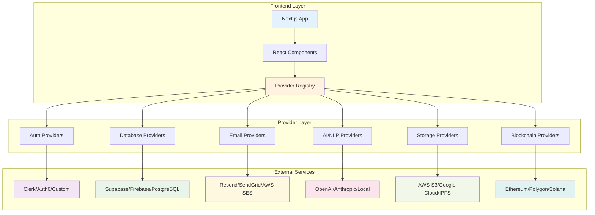

## 👤 **User Journey Flows**

### **Candidate Journey**

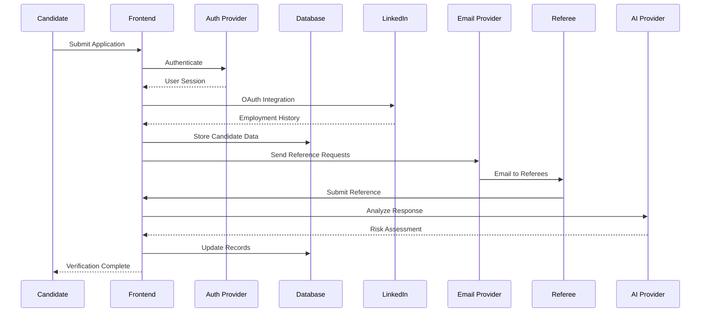

### **Referee Journey**

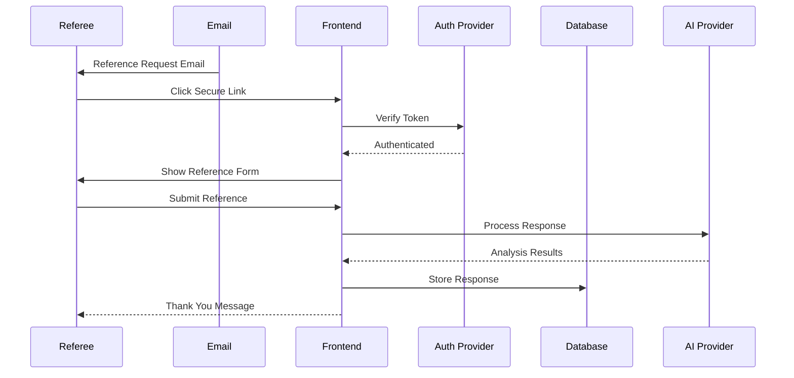

### **Admin Journey**

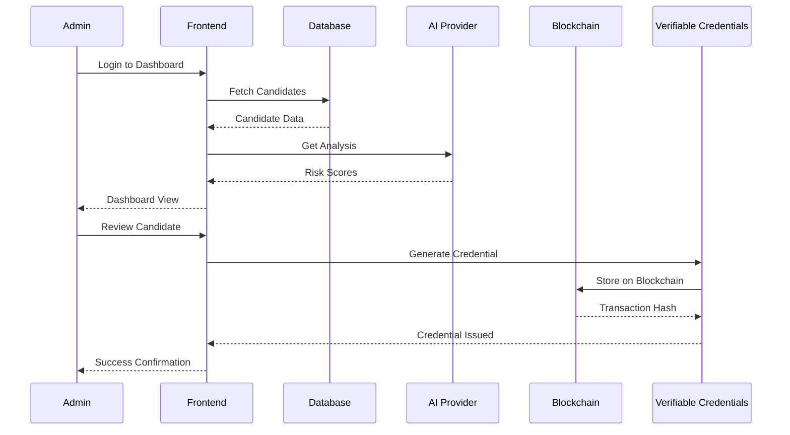

## 🏗️ **Technical Architecture**

### **Provider Registry System**

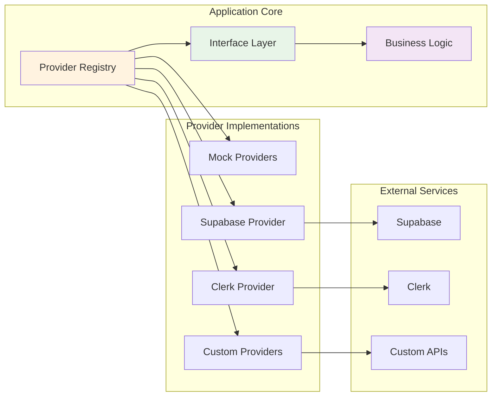

### **Data Flow Architecture**

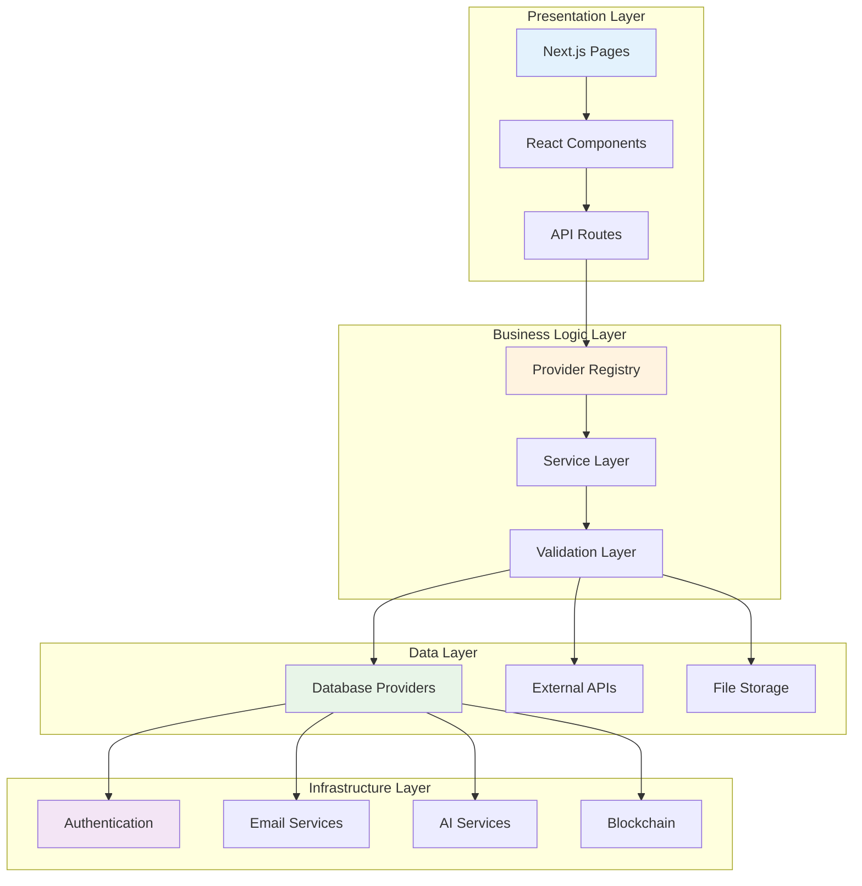

## 🔐 **Security & Privacy Architecture**

### **Authentication Flow**

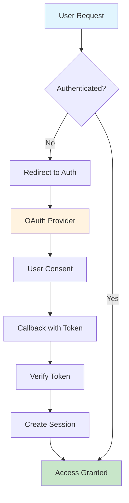

### **Verifiable Credentials Flow**

#### **Mermaid Diagram**
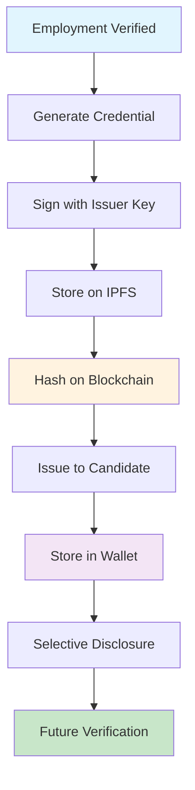

#### **ASCII Flow Diagram**
```
          +-------------------------+
          |  Previous Employer (HR)|
          | Issues Verifiable Cred |
          +-----------+------------+
                      |
                      v
          +-------------------------+
          | Off-chain VC Storage    |
          | (IPFS, Ceramic, etc)    |
          +-----------+------------+
                      |
                      v
          +-------------------------+
          |  Hash posted on-chain   |
          |  (e.g. Ethereum, Polygon)|
          +-----------+------------+
                      |
                      v
          +-------------------------+
          | Candidate submits claims|
          | + VCs to new employer   |
          +-----------+------------+
                      |
                      v
          +-------------------------+
          | New Employer verifies   |
          | claims + VCs + red flags|
          +-------------------------+
```

## 📊 **Data Models**

### **Core Entities**

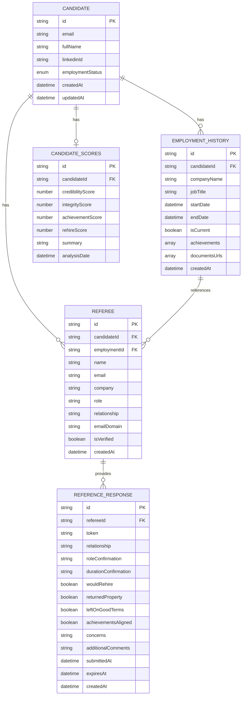

## 🚀 **Deployment Architecture**

### **Production Deployment**

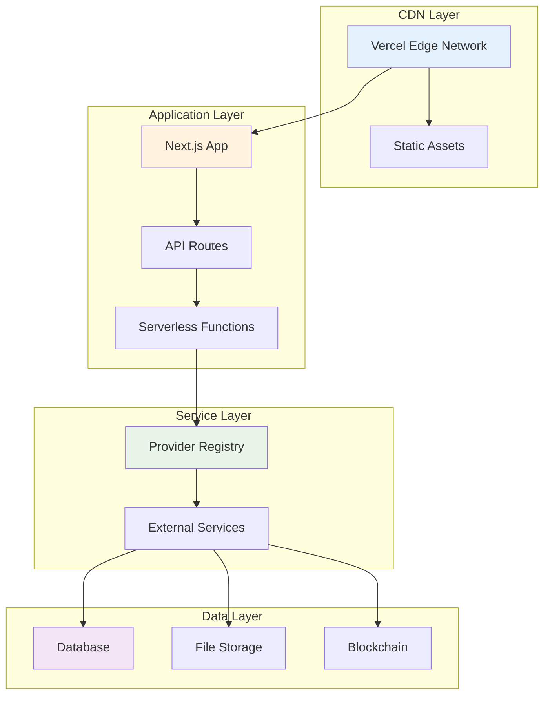

### **Development Environment**

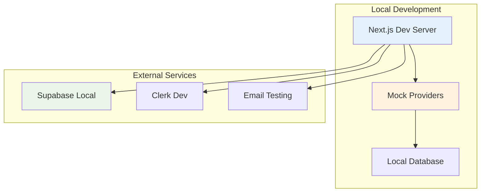

## 🔄 **Provider Integration Patterns**

### **Standard Provider Pattern**

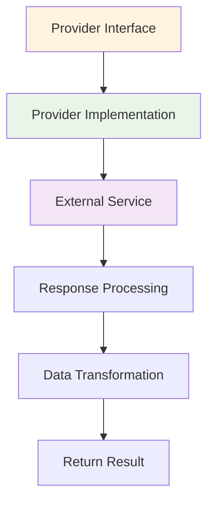

### **Provider Registry Pattern**

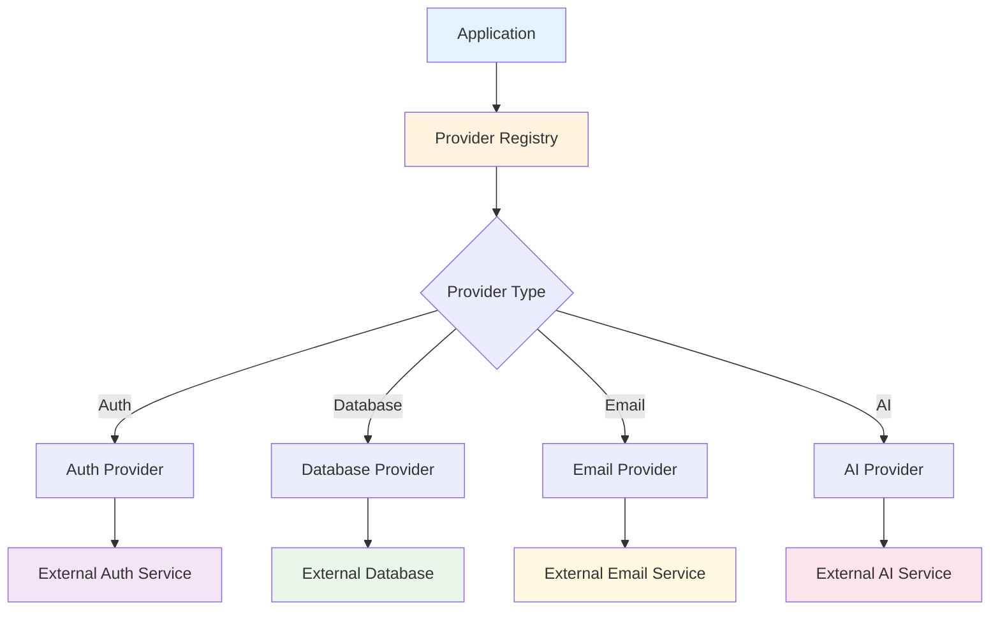

---

*These diagrams are living documents and will be updated as the architecture evolves. They provide a visual representation of the system's design and can be used for development planning and documentation.* 