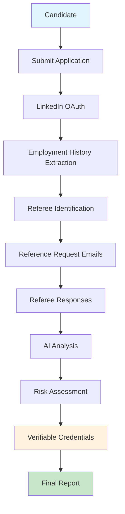
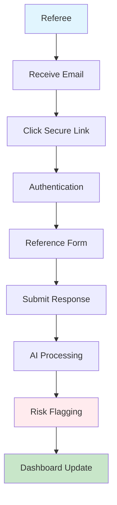
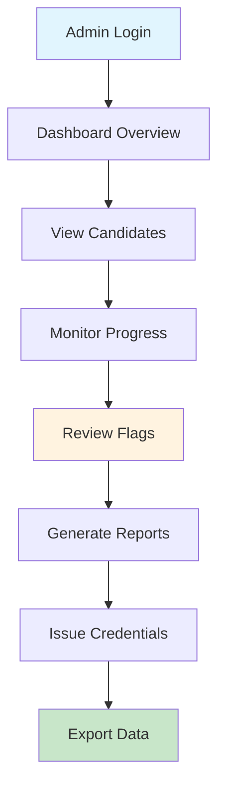
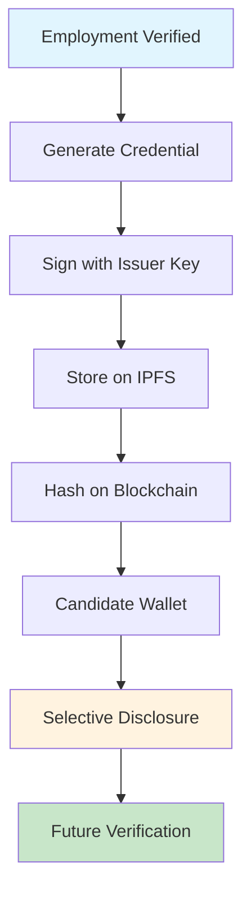

# Vision & Goals - Reference Validator Open Source Project

## 🎯 **Project Vision**

**To democratize employment verification by providing an open-source, provider-agnostic foundation that enables any organization to build robust reference and employment validation systems with their preferred technology stack.**

## 🌟 **Core Mission**

Transform the hiring process by making employment verification:
- **Accessible** - Open source foundation anyone can use
- **Flexible** - Works with any technology stack
- **Privacy-First** - Built with verifiable credentials and zero-knowledge proofs
- **Intelligent** - AI-powered analysis and risk assessment
- **Transparent** - Open source code and clear processes

## 🎯 **Primary Goals**

### 1. **Democratize Employment Verification**
- **Goal**: Make enterprise-grade employment verification accessible to organizations of all sizes
- **Impact**: Small companies can now afford the same verification capabilities as Fortune 500 companies
- **Approach**: Open source foundation with pluggable providers

### 2. **Provider-Agnostic Architecture**
- **Goal**: Enable developers to use their preferred technology stack
- **Impact**: No vendor lock-in, maximum flexibility
- **Approach**: Abstract interfaces with multiple provider implementations

### 3. **Privacy-Preserving Verification**
- **Goal**: Implement verifiable credentials and zero-knowledge proofs
- **Impact**: Candidates maintain control over their data while proving employment
- **Approach**: Blockchain-based credentials with selective disclosure

### 4. **AI-Powered Intelligence**
- **Goal**: Automate reference analysis and risk assessment
- **Impact**: Faster, more accurate hiring decisions
- **Approach**: Pluggable AI providers with customizable scoring

### 5. **Community-Driven Development**
- **Goal**: Build a thriving open source community
- **Impact**: Continuous improvement and innovation
- **Approach**: Clear contribution guidelines and modular architecture

## 🔄 **Intended User Flows**

### **Flow 1: Candidate Submission & Verification**



**Key Features:**
- **Automated LinkedIn Integration**: Extract employment history automatically
- **Smart Referee Detection**: Identify appropriate referees from employment data
- **AI-Powered Analysis**: Analyze reference responses for credibility and risk
- **Verifiable Credentials**: Issue blockchain-based employment credentials

### **Flow 2: Reference Response Collection**



**Key Features:**
- **Secure Authentication**: Token-based secure access
- **Comprehensive Forms**: Structured reference questions
- **Real-time Processing**: Immediate AI analysis
- **Risk Detection**: Automatic flagging of concerning responses

### **Flow 3: Admin Dashboard & Management**



**Key Features:**
- **Real-time Monitoring**: Live updates on verification progress
- **Risk Management**: Centralized view of flagged candidates
- **Credential Management**: Issue and manage verifiable credentials
- **Reporting**: Comprehensive analytics and reporting

### **Flow 4: Verifiable Credentials & Blockchain**



**Key Features:**
- **W3C Compliant**: Standard verifiable credentials
- **Decentralized Storage**: IPFS for credential storage
- **Blockchain Anchoring**: Immutable proof of issuance
- **Selective Disclosure**: Candidates control what information to share

## 🏗️ **Technical Architecture Vision**

### **Provider Ecosystem**

```
┌─────────────────────────────────────────────────────────────────┐
│                    Reference Validator Core                     │
├─────────────────────────────────────────────────────────────────┤
│  Provider Registry & Interface Layer                           │
├─────────────────────────────────────────────────────────────────┤
│  Auth Providers    │  Database Providers  │  Email Providers   │
│  • Clerk          │  • Supabase          │  • Resend          │
│  • Auth0          │  • Firebase          │  • SendGrid        │
│  • Custom JWT     │  • PostgreSQL        │  • AWS SES         │
│  • Mock           │  • MongoDB           │  • Custom          │
├─────────────────────────────────────────────────────────────────┤
│  AI/NLP Providers │  Storage Providers   │  Blockchain        │
│  • OpenAI         │  • AWS S3            │  • Ethereum        │
│  • Anthropic      │  • Google Cloud      │  • Polygon         │
│  • Local Models   │  • IPFS              │  • Solana          │
│  • Custom         │  • Custom            │  • Custom          │
└─────────────────────────────────────────────────────────────────┘
```

### **Data Flow Architecture**

```
┌─────────────┐    ┌─────────────┐    ┌─────────────┐    ┌─────────────┐
│   Frontend  │    │   API Layer │    │  Providers  │    │  External   │
│  (Next.js)  │◄──►│  (Next.js)  │◄──►│  (Registry) │◄──►│  Services   │
└─────────────┘    └─────────────┘    └─────────────┘    └─────────────┘
       │                   │                   │                   │
       ▼                   ▼                   ▼                   ▼
┌─────────────┐    ┌─────────────┐    ┌─────────────┐    ┌─────────────┐
│   UI/UX     │    │ Validation  │    │  Business   │    │  Databases  │
│ Components  │    │ & Security  │    │   Logic     │    │  & APIs     │
└─────────────┘    └─────────────┘    └─────────────┘    └─────────────┘
```

## 🎯 **Success Metrics**

### **Technical Success**
- [ ] **Provider Ecosystem**: 10+ provider implementations
- [ ] **Performance**: <2s response time for all operations
- [ ] **Reliability**: 99.9% uptime for core services
- [ ] **Security**: Zero critical security vulnerabilities

### **Community Success**
- [ ] **Contributors**: 50+ active contributors
- [ ] **Forks**: 100+ project forks
- [ ] **Stars**: 1000+ GitHub stars
- [ ] **Adoption**: 100+ organizations using the foundation

### **Business Impact**
- [ ] **Cost Reduction**: 80% reduction in verification costs
- [ ] **Time Savings**: 70% faster verification process
- [ ] **Accuracy**: 95% accuracy in employment verification
- [ ] **Privacy**: 100% candidate data control

## 🚀 **Roadmap & Milestones**

### **Phase 1: Foundation (Complete) ✅**
- [x] Provider-agnostic architecture
- [x] Mock providers for development
- [x] Basic UI and API structure
- [x] Documentation and guides

### **Phase 2: Core Features (In Progress) 🔄**
- [ ] Real provider implementations (Supabase, Clerk, etc.)
- [ ] Complete candidate submission flow
- [ ] Reference response collection
- [ ] Basic AI analysis

### **Phase 3: Advanced Features (Planned) 📋**
- [ ] Verifiable credentials implementation
- [ ] Zero-knowledge proofs
- [ ] Advanced AI scoring
- [ ] Blockchain integration

### **Phase 4: Enterprise Features (Future) 🔮**
- [ ] Multi-tenant support
- [ ] Advanced analytics
- [ ] Compliance frameworks
- [ ] Enterprise integrations

## 🌍 **Impact Vision**

### **For Organizations**
- **Cost Efficiency**: Reduce verification costs by 80%
- **Speed**: Accelerate hiring by 70%
- **Quality**: Improve hiring decisions with AI insights
- **Compliance**: Built-in compliance and audit trails

### **For Candidates**
- **Privacy**: Control over personal data
- **Portability**: Reusable verifiable credentials
- **Transparency**: Clear verification process
- **Efficiency**: Faster application processing

### **For the Industry**
- **Standardization**: Open standards for employment verification
- **Innovation**: Community-driven feature development
- **Accessibility**: Enterprise capabilities for all organizations
- **Trust**: Transparent, auditable verification processes

## 🤝 **Community Vision**

### **Open Source Principles**
- **Transparency**: All code and processes open to review
- **Collaboration**: Community-driven development
- **Innovation**: Continuous improvement through contributions
- **Accessibility**: Available to organizations of all sizes

### **Contributor Experience**
- **Clear Guidelines**: Comprehensive contributing documentation
- **Modular Architecture**: Easy to contribute specific features
- **Provider System**: Simple to add new service integrations
- **Recognition**: Proper attribution and community recognition

## 🎉 **Long-term Vision**

**By 2025, Reference Validator will be the de facto open-source standard for employment verification, powering verification systems for thousands of organizations worldwide while maintaining the highest standards of privacy, security, and user control.**

---

*This vision document is living and will be updated as the project evolves. We welcome community input and contributions to help shape the future of employment verification.* 